# RentARoof 🏠

RentARoof is a Flutter-based mobile application designed to simplify the process of renting homes. Whether you're a property owner looking to list your home or a tenant searching for the perfect rental, RentARoof has got you covered. The app allows users to add properties, save them for future reference, chat with property owners, and even book visits. Additional features like "Refer and Earn," "Contact Support," and "Featured Properties" make the experience even more seamless.

---

## Features ✨

- **Add Properties**: Easily list your property for rent with detailed descriptions and images.
- **Search Properties**: Find available homes for rent with advanced search filters.
- **Save Properties**: Save properties to revisit them later.
- **Chat with Owners**: Communicate directly with property owners or interested tenants.
- **Book Visits**: Schedule visits to properties you're interested in.
- **Refer and Earn**: Earn rewards by referring friends to the app.
- **Contact Support**: Get help whenever you need it.
- **Featured Properties**: Discover curated properties featured by RentARoof.

---

## Architecture 🏗️

The app follows the **Model-View-Controller (MVC)** architecture for clean and maintainable code.

### Project Structure 🌳

```
lib/
├── controllers/        # Contains all the business logic
├── models/             # Contains data models
├── views/              # Contains UI screens and pages
├── utils/              # Utility files
│   ├── sizer.dart      # Responsive sizing utility
│   ├── styles.dart     # App-wide styling
│   ├── shared_preference_helper.dart # SharedPreferences helper
├── widgets/            # Custom reusable components
└── main.dart           # Entry point of the app
```

---

## Dependencies 📦

Here are the key dependencies used in the project:

- **cupertino_icons**: ^1.0.2
- **motion_tab_bar_v2**: ^0.3.0
- **circular_bottom_navigation**: ^2.2.0
- **font_awesome_flutter**: ^10.2.1
- **shared_preferences**: ^2.0.15
- **carousel_slider**: ^5.0.0
- **cached_network_image**: ^3.2.2
- **shimmer**: ^3.0.0
- **flutter_svg**: ^2.0.17

---

## Screenshots 📸

|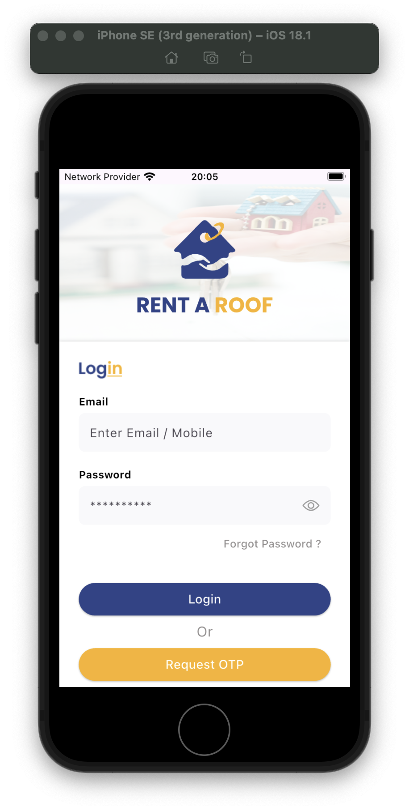|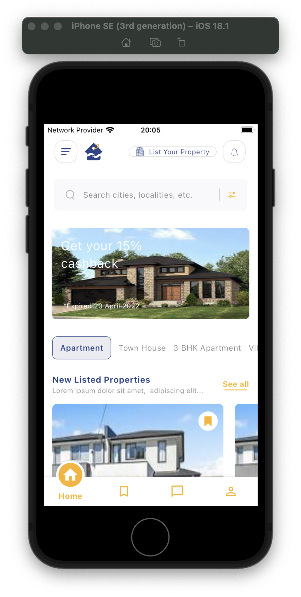|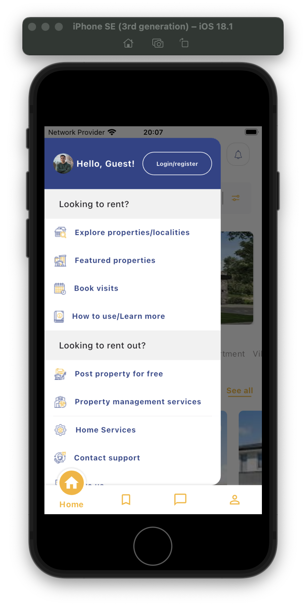|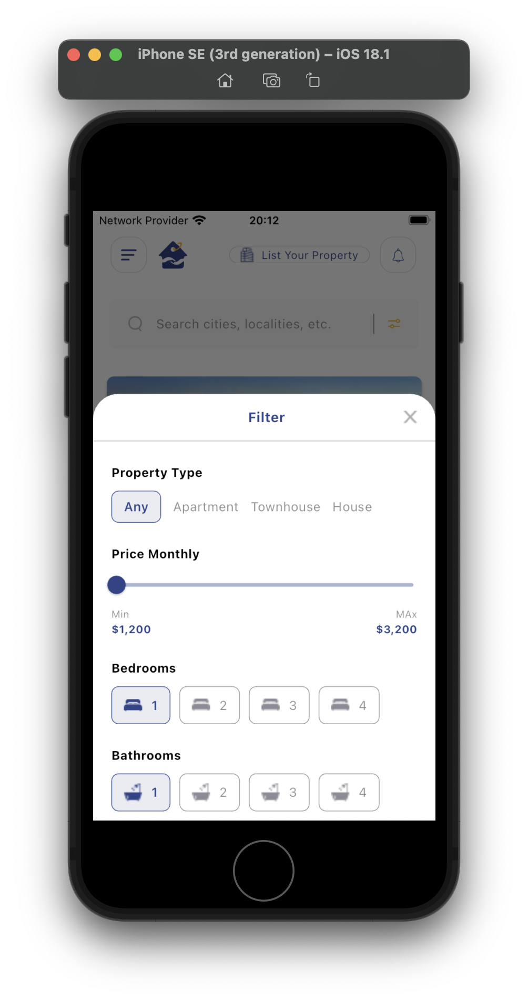|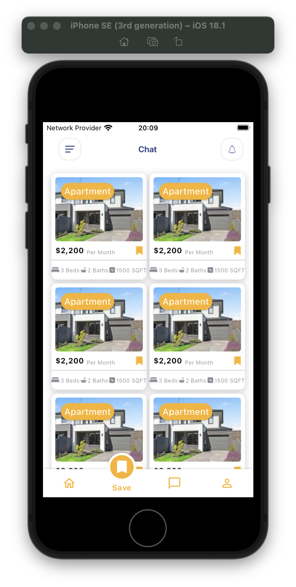|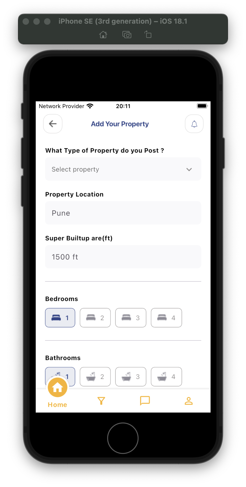|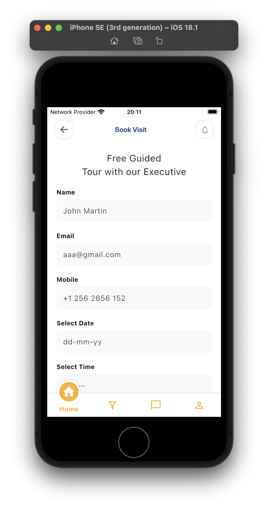|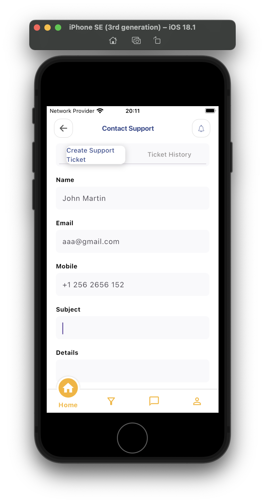|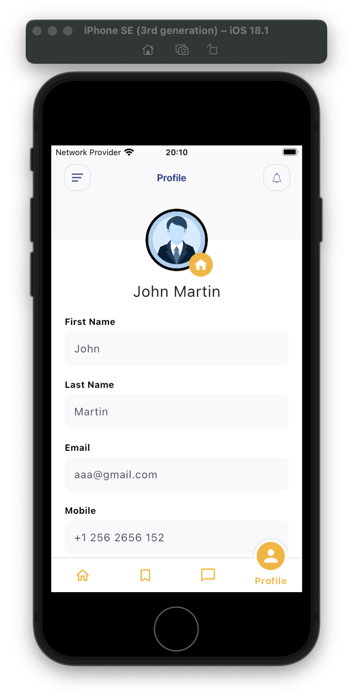|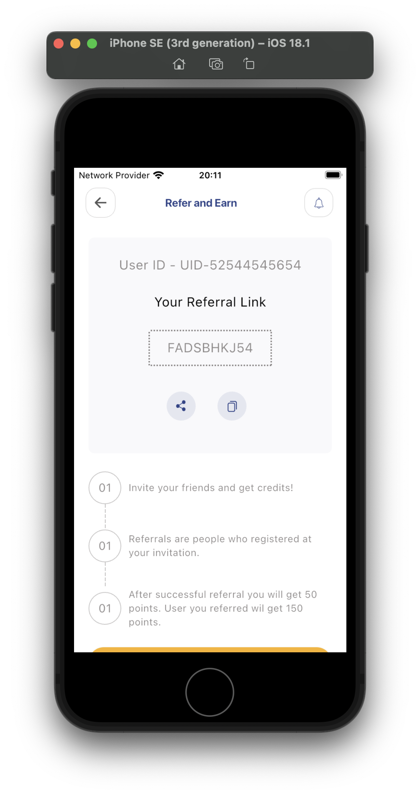|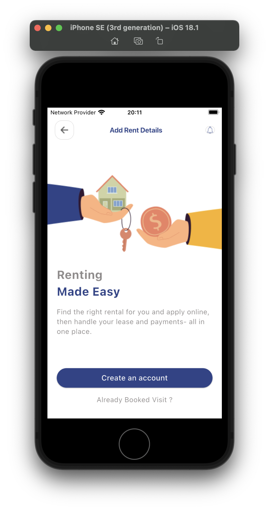|

---

## How to Run 🚀

1. **Clone the repository**:
   ```bash
   git clone https://github.com/asmitranjansinha/rentaroof.git
   ```
2. **Navigate to the project directory**:
   ```bash
   cd rentaroof
   ```
3. **Install dependencies**:
   ```bash
   flutter pub get
   ```
4. **Run the app**:
   ```bash
   flutter run
   ```

---

## Contribution 🤝

Contributions are welcome! If you'd like to contribute, please follow these steps:

1. Fork the repository.
2. Create a new branch (`git checkout -b feature/YourFeatureName`).
3. Commit your changes (`git commit -m 'Add some feature'`).
4. Push to the branch (`git push origin feature/YourFeatureName`).
5. Open a pull request.

---

## License 📄

This project is licensed under the MIT License. See the [LICENSE](LICENSE) file for details.

---

Happy Renting! 🎉
